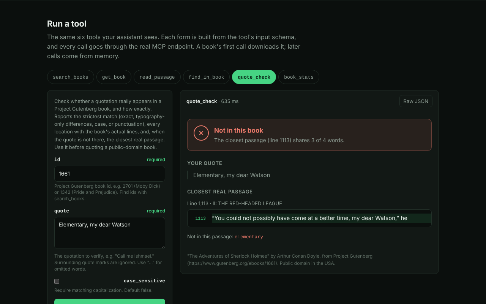

# gutenberg-mcp

An [MCP](https://modelcontextprotocol.io) server that lets Claude, ChatGPT, Cursor or any MCP client search, read and accurately quote public-domain books from [Project Gutenberg](https://www.gutenberg.org/), the free library of 75,000+ ebooks. MCP (Model Context Protocol) is the open standard that lets AI apps call outside tools.

It finds books through [Gutendex](https://gutendex.com) (a JSON API over the Gutenberg catalog), downloads the plain text from gutenberg.org, strips the license header and footer, detects the chapters, and gives the model stable line numbers to read and cite. Its most useful tool is `quote_check`: it tells the model whether a quotation is really in the book, how faithful the copy is, and what the book actually says. It runs locally over stdio (`npx gutenberg-mcp`) or as a remote server over Streamable HTTP with a web playground. No API key.



## What you can ask

> Is "Call me Ishmael" really the first line of Moby Dick? Which chapter?

> Quote the opening sentence of Pride and Prejudice exactly, with the line number.

> Does Sherlock Holmes ever say "Elementary, my dear Watson" in The Adventures of Sherlock Holmes?

> Read me the first stave of A Christmas Carol.

> Where does the white whale come up most in Moby Dick?

> How long is Dracula, and which chapter is the longest?

## Why quote_check exists

Language models misquote. They smooth out punctuation, swap a word ("Lead on, Macduff" for "Lay on, Macduff"), merge two lines, or attach a film line to the book it was adapted from. The result reads right and is wrong, and it ends up in essays, slides and articles.

`quote_check` checks the quote against the real text at four levels, strictest first, and reports the first that matches:

| `match` | Meaning | Example |
| --- | --- | --- |
| `exact` | Same characters (only spacing and line breaks differ) | "Call me Ishmael." in Moby Dick |
| `typography` | Only quote marks, apostrophes, dash style or `_italic_` markers differ | `don't` vs `don’t`, `--` vs `—` |
| `case` | Same text, different capitals | "Marley was dead" vs "MARLEY was dead" |
| `words` | Same words in order, punctuation differs | Austen's opening line without its comma |
| `none` | Not in the book | "Elementary, my dear Watson" |

Every hit comes back with its line numbers, chapter and the book's own lines, so the model can quote from the text instead of from memory. When the quote is not there, it returns the closest real passage (the window of the book that shares the most words with the quote, ranking content words above words like "the") and lists the words that are missing. Parts joined by `...` are checked in order. A match can't start or end inside a word, so "all me Ishmael" does not match.

## Install

Requires Node.js 20 or newer.

### Claude Code

```bash
# local, over stdio
claude mcp add --transport stdio gutenberg -- npx -y gutenberg-mcp

# or a hosted copy, over HTTP
claude mcp add --transport http gutenberg https://YOUR-HOST/mcp
```

### Claude Desktop

Add this to `claude_desktop_config.json` (macOS: `~/Library/Application Support/Claude/`, Windows: `%APPDATA%\Claude\`), then restart Claude Desktop:

```json
{
  "mcpServers": {
    "gutenberg": {
      "command": "npx",
      "args": ["-y", "gutenberg-mcp"]
    }
  }
}
```

For a hosted copy on a Pro, Max, Team or Enterprise plan: in Settings, open Connectors, choose Add custom connector, and paste `https://YOUR-HOST/mcp`.

### Cursor

Add to `~/.cursor/mcp.json` (all projects) or `.cursor/mcp.json` (one project):

```json
{
  "mcpServers": {
    "gutenberg": { "command": "npx", "args": ["-y", "gutenberg-mcp"] }
  }
}
```

For a hosted copy, use `{ "url": "https://YOUR-HOST/mcp" }` instead.

### Other clients

Any client that speaks MCP over stdio or Streamable HTTP works. To poke at the server by hand, run `npx @modelcontextprotocol/inspector`.

### From source

```bash
git clone https://github.com/frogr/gutenberg-mcp && cd gutenberg-mcp
npm install && npm run build
# stdio: "command": "node", "args": ["/absolute/path/to/gutenberg-mcp/dist/index.js"]
# HTTP:  npm start  (playground at http://localhost:3000, MCP at /mcp)
```

## Tools

| Tool | What it does | Key inputs | Returns |
| --- | --- | --- | --- |
| `search_books` | Search the catalog by title and author words | `query`, `author`, `language` (two-letter codes), `topic`, `page` | Book ids, titles, authors with life years, subjects, 30-day downloads, whether a plain-text edition exists |
| `get_book` | Metadata plus the table of contents | `id` | Title, authors, subjects, summary, line count, and every detected chapter/letter/stave/act/scene with start and end lines |
| `read_passage` | Read by chapter or line | `id`, `chapter` or `start_line`, `max_lines` ≤ 200 | Numbered lines, the chapter they belong to, `next_start_line` for paging |
| `find_in_book` | Find a word or phrase | `id`, `query`, `whole_word`, `max_results` ≤ 20, `context_lines` ≤ 5 | Total count, counts per chapter, first matches with numbered context |
| `quote_check` | Verify a quotation | `id`, `quote` (≤ 2,000 chars), `case_sensitive` | `found`, `match` level, verdict, every location with the real lines, or the closest passage and the missing words |
| `book_stats` | Count things | `id`, `top_n` | Words, unique words, sentences, average sentence and word length, reading time, top content words, longest and shortest chapter |

Every tool is read-only (`readOnlyHint: true`), validates its input with zod, and declares an `outputSchema`. Results come back as JSON text, which every client can read, and as `structuredContent` for clients that use it. Every result that contains book text carries an `attribution` line naming the book and its gutenberg.org page.

## How it works

**Text.** Books are fetched from `https://www.gutenberg.org/cache/epub/{id}/pg{id}.txt`, the address Gutenberg's own `.txt.utf-8` links redirect to, so reading a book does not wait for the catalog. If that file is missing, the server asks Gutendex for the book's formats and takes the best `text/plain` one (UTF-8 first). Only gutenberg.org hosts are allowed. Files over 16 MB are refused while streaming, before they are held in memory.

**License header and footer.** Everything before `*** START OF THE PROJECT GUTENBERG EBOOK ... ***` and after the matching `END` line is removed, including older variants (`THIS PROJECT GUTENBERG EBOOK`, `E-BOOK`, `End of the Project Gutenberg EBook of ...`). The title, author, language and release date are read from the header first, so `get_book` can still answer if the catalog is down. A short attribution line replaces the license.

**Line numbers.** Line 1 is the first line after the header. All tools use the same numbering, so a line from `find_in_book` can go straight into `read_passage` or a citation.

**Chapters.** A heading is a short line after a blank line that is either a keyword plus a number (`CHAPTER XII.`, `Chapter 3: The Ball`, `BOOK THE FIRST`, `STAVE III`, `Letter 4`, `SCENE II. A Street.`), a Roman numeral with an all-caps title (`IV. THE BOSCOMBE VALLEY MYSTERY`) or a title on the next line, or a section word (`PREFACE`, `ETYMOLOGY`, `EPILOGUE`). Then:
- a run of three or more headings with no text between them is a printed contents page and is dropped;
- book, part, volume and act headings group what follows, so `CHAPTER I` of Book Two is not a duplicate of `CHAPTER I` of Book One;
- a heading printed twice keeps the later copy, and borrows the earlier copy's title if it has none;
- a bare word like `PROLOGUE.` with a speech right under it is a character in a play, not a heading;
- if nothing else is found, a bare `I`, `II`, `III` sequence is used (short works like Heart of Darkness).

`scripts/eval.mjs` checks this against 21 books (see [PROOF.md](PROOF.md)).

**Search.** `find_in_book` and `quote_check` search a normalized copy of the book (line breaks become spaces; curly quotes, dashes and `_italics_` markers are unified; case folded) and map each hit back to its source lines with a binary search over per-line offsets. That index costs one integer per line, not per character.

**Caching.** Parsed books live in an in-memory LRU bounded by an estimated byte budget (`BOOK_CACHE_MB`, default 160) and 24 entries. Two tools asking for the same book at once share one download. Catalog responses are cached for an hour.

**Gutendex is sometimes slow.** Popular searches come back in under a second, but uncached ones took 40 to 60 seconds or timed out when tested (see PROOF.md). So `search_books` waits 8 seconds for Gutendex and then answers from gutenberg.org's own search feed (ids, titles and authors only, no filters), saying so in `source` and `note`. The Gutendex request keeps running and is cached for next time. `get_book` waits up to 3 seconds for the catalog after the text arrives, then falls back to the title and author in the file header.

**Errors.** Upstream failures become tool errors (`isError: true`) that say what happened and what to try next:

```
No Project Gutenberg book has id 424242. (HTTP 404)
Hint: Use search_books to find the right id.
```

Unexpected errors are logged on the server and reach the client only as a generic message.

## Remote server

`npm start` (or `node dist/http.js`) serves:

| Route | Purpose |
| --- | --- |
| `POST /mcp` | MCP over Streamable HTTP, stateless, JSON responses (official `@modelcontextprotocol/sdk` transport) |
| `GET /health` | Status, version, cached book count, limits. Never calls upstream. |
| `GET /` | Web playground: run every tool from a form, rendered results, raw JSON toggle, client config snippets |

Limits, all set by env var: 30 requests per minute per IP on `/mcp` (token bucket, `RATE_LIMIT_PER_MINUTE`), 5,000 requests per UTC day across everyone (`DAILY_REQUEST_LIMIT`), 64 KB request bodies (`MAX_BODY_BYTES`, enforced while streaming), 30 seconds per request (`REQUEST_TIMEOUT_MS`), slow-header protection, and CORS (`CORS_ORIGINS`, default `*`). Rate-limited responses carry `Retry-After`. Behind a proxy, set `TRUST_PROXY` to the number of proxies so the real client IP is used and a spoofed `X-Forwarded-For` is ignored. The playground page is served with a strict Content-Security-Policy and builds all book text into the page as text nodes, never HTML.

### Configuration

| Env var | Default | Purpose |
| --- | --- | --- |
| `GUTENDEX_URL` | `https://gutendex.com` | Catalog API. Gutendex is open source; point this at your own copy if you need speed. |
| `GUTENDEX_TIMEOUT_MS` | `20000` | Timeout for one catalog request |
| `TEXT_TIMEOUT_MS` | `30000` | Timeout for one book download |
| `MAX_BOOK_MB` | `16` | Largest book file accepted |
| `BOOK_CACHE_MB` | `160` | Memory budget for parsed books (estimated) |
| `PORT`, `HOST` | `3000`, `0.0.0.0` | HTTP only |
| `RATE_LIMIT_PER_MINUTE` | `30` | HTTP only, per IP |
| `DAILY_REQUEST_LIMIT` | `5000` | HTTP only, global |
| `MAX_BODY_BYTES` | `65536` | HTTP only |
| `REQUEST_TIMEOUT_MS` | `30000` | HTTP only |
| `CORS_ORIGINS` | `*` | HTTP only, `*` or a comma-separated allow list |
| `TRUST_PROXY` | `0` | HTTP only, number of reverse proxies in front |

`.env.example` lists them all.

## Deploy

### Render (free plan)

1. Push this repo to GitHub.
2. In Render: New > Blueprint, pick the repo. `render.yaml` sets up a free web service with `npm ci && npm run build`, `npm start`, a `/health` check, `TRUST_PROXY=1` and `BOOK_CACHE_MB=150` (the free plan has 512 MB of RAM).
3. When it is live, open the URL for the playground. The MCP endpoint is `https://<your-service>.onrender.com/mcp`.

Free Render services sleep when idle, so the first request after a while takes longer, and the book cache starts empty after each sleep.

### Docker

```bash
docker build -t gutenberg-mcp .
docker run -p 3000:3000 gutenberg-mcp
```

## Development

```bash
npm install
npm test                         # vitest, recorded fixtures only, no network
npm run typecheck
npm run build
node scripts/smoke.mjs           # stdio: initialize + tools/list (add --live for a real call)
node scripts/smoke-http.mjs      # HTTP: /health, CORS, initialize, tools/list, playground (add --live)
node scripts/call.mjs quote_check '{"id":2701,"quote":"Call me Ishmael."}'   # one live tool call
node scripts/eval.mjs            # live accuracy check: 22 quotes, 21 books
node scripts/screenshots.mjs     # Playwright screenshots of the playground into docs/screenshots
```

Tests run against two recorded book excerpts (Moby Dick and Pride and Prejudice, with their real license header and footer), recorded Gutendex and gutenberg.org search responses, and a mocked `fetch` that throws on any request it does not expect. `test/server.test.ts` runs the full MCP protocol in memory; `test/http.test.ts` runs the SDK client against a real local socket.

```
src/
  index.ts            stdio entrypoint (the npx bin)
  http.ts, app.ts     remote server: Node adapter, routes, limits
  server.ts           tool registration
  gutenberg.ts        Gutendex + gutenberg.org client: timeouts, retries, caches, errors
  book.ts             a parsed book: lines, chapters, lazy search indexes and stats
  text/               header stripping, chapter detection, normalization, stats, LRU
  tools/              one file per tool: zod input/output schemas + handler
public/index.html     playground (no build step, no dependencies)
eval/                 hand-labeled quotes and book structures for scripts/eval.mjs
```

## License

MIT © Austin French. Book texts are public domain in the USA and come from Project Gutenberg; this project is not affiliated with Project Gutenberg or Gutendex.

---

Need an MCP server for your own data? [austn.net](https://austn.net)
